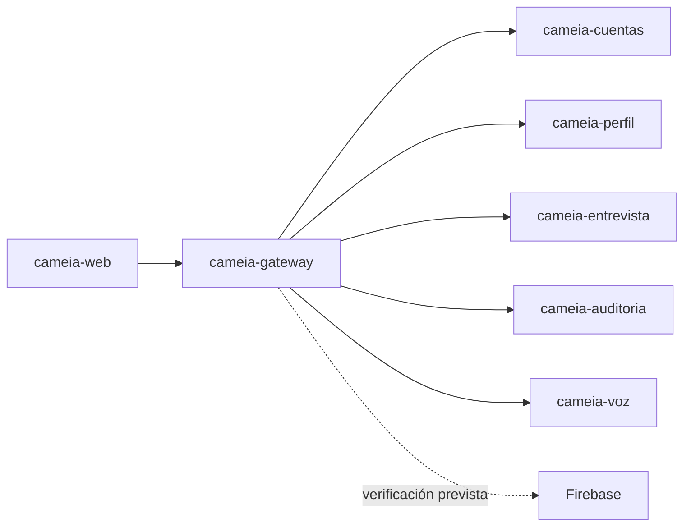

# cameia-gateway

API Gateway de CAMEIA. Proporciona el punto de entrada controlado para la aplicación web y enruta solicitudes hacia los microservicios del MVP.

> **Estado:** repositorio creado para el Sprint 1. La estructura y dependencias se implementan mediante [CM-104](https://f0rktech.atlassian.net/browse/CM-104); este README no demuestra que el Gateway ya esté operativo.

## Alcance del Sprint 1

- Crear la estructura técnica y dependencias del Gateway.
- Preparar enrutamiento hacia los servicios realmente incluidos en el incremento.
- Definir controles transversales solo cuando sus contratos y criterios estén aprobados.

No implementa reglas de negocio de Cuentas, Perfil, Entrevista, Auditoría o Voz.

## Responsabilidades

- Recibir las solicitudes de la aplicación web.
- Verificar y propagar identidad/autorización según la decisión de Firebase.
- Enrutar hacia el servicio responsable sin acceder a sus bases de datos.
- Aplicar controles transversales aprobados: validación, CORS, límites o trazabilidad.
- Exponer respuestas y errores consistentes sin revelar información sensible.

## Contexto arquitectónico



## Tecnología prevista

| Elemento | Línea base |
|---|---|
| Lenguaje | Java 21 |
| Framework | Spring Boot 4.1.1 |
| Build | Maven; wrapper pendiente de confirmar en CM-104 |
| Ejecución objetivo | Contenedor OCI en Cloud Run |

## Contratos y dependencias

| Dependencia | Uso previsto | Estado |
|---|---|---|
| `cameia-web` | Consumidor público del Gateway | Contrato pendiente |
| Microservicios CAMEIA | Destinos internos de enrutamiento | Rutas pendientes |
| Firebase Admin | Verificación de identidad/custom claims | Pendiente de implementación |

## Ejecución local

```text
Instalación: pendiente de confirmar en CM-104
Pruebas: pendiente de confirmar en CM-104
Build: pendiente de confirmar en CM-104
Inicio: pendiente de confirmar en CM-104
Health check: pendiente de confirmar en CM-104
```

## Configuración y seguridad

- No guardar secretos, credenciales Firebase ni `.env` en Git.
- Aplicar mínimo privilegio y no propagar datos que el servicio destino no necesite.
- No registrar tokens, CV, transcripciones ni payloads sensibles completos.
- Documentar variables por nombre y propósito en `.env.example` cuando sean aprobadas.

## Calidad esperada

- Pruebas de enrutamiento, errores, autenticación y autorización aplicables.
- Fallos seguros ante token inválido, destino no disponible o timeout.
- Formato, lint, pruebas, build y seguridad en CI cuando existan comandos reales.

## Contribución

- Rama estable: `main`.
- Rama de integración: `develop`.
- Ramas de trabajo: `CA-<numero>-<descripcion-kebab-case>`, creadas desde `develop`.
- Los cambios ordinarios se integran a `develop` mediante Pull Request y Squash.
- La promoción `develop → main` utiliza un PR independiente y Merge commit.
- Las ramas `CA-*` se eliminan después del merge; `develop` se conserva.
- El autor no puede ser la única aprobación.

## Cuándo actualizar este README

Actualizarlo en el mismo PR que cambie propósito, stack, comandos, variables, rutas, autenticación, contratos, estructura, pruebas, despliegue o responsables. Si el cambio no requiere actualización, justificarlo en la plantilla del PR.