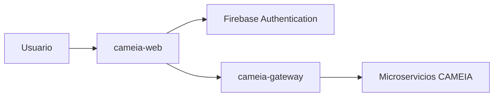

# cameia-web

Aplicación web de CAMEIA para construir el perfil profesional, configurar y realizar entrevistas, y consultar resultados del MVP.

> **Estado:** repositorio creado para el Sprint 1. Este README describe la línea base arquitectónica; una capacidad solo se considera implementada cuando existe código, pruebas y evidencia.

## Alcance del Sprint 1

- Configuración inicial del frontend: [CM-100](https://f0rktech.atlassian.net/browse/CM-100).
- Interfaces para las historias de Cuentas, Perfil Profesional y Entrevista incluidas en el sprint.
- Integración de las APIs exclusivamente mediante `cameia-gateway`.

No incluye búsqueda de empleo, persistencia de video ni funcionalidades Post-MVP.

## Responsabilidades

- Presentar los flujos y estados de interacción del usuario.
- Validar entradas en cliente sin sustituir la validación del backend.
- Gestionar la sesión de Firebase según el mecanismo aprobado.
- Consumir contratos publicados por el Gateway.
- Cumplir accesibilidad, manejo de errores y protección de datos en el navegador.

No contiene reglas de negocio de los microservicios ni accede directamente a sus bases de datos.

## Contexto arquitectónico



## Tecnología prevista

| Elemento           | Línea base                                               |
| ------------------ | -------------------------------------------------------- |
| Interfaz           | React 19                                                 |
| Bundler            | Vite 8                                                   |
| Runtime            | Node 24 LTS (ver `.nvmrc`)                               |
| Gestor de paquetes | pnpm 11.25.0 (`packageManager`, gestionado por Corepack) |
| Despliegue         | Firebase Hosting                                         |
| Autenticación      | Firebase Authentication                                  |
| Integración        | HTTPS/JSON mediante `cameia-gateway`                     |

La arquitectura completa del frontend — árbol de carpetas, anatomía de una feature, fronteras entre
capas y convenciones de nombres — está documentada en [`docs/ARCHITECTURE.md`](docs/ARCHITECTURE.md).

## Ejecución local

Requiere Node 24.x y Corepack habilitado (`corepack enable`) para que pnpm quede fijado en la
versión declarada en `packageManager`.

```bash
# Instalación
pnpm install

# Variables de entorno
cp .env.example .env

# Desarrollo
pnpm dev

# Calidad
pnpm typecheck
pnpm lint
pnpm format

# Pruebas
pnpm test
pnpm test:watch
pnpm test:coverage

# Build de producción
pnpm build
pnpm preview
```

## Configuración y seguridad

- No guardar tokens, credenciales, CV, audio, video ni `.env` en Git.
- Las variables públicas del frontend deben distinguirse de secretos del backend.
- No exponer llamadas directas a microservicios internos.
- Usar datos sintéticos o anonimizados en pruebas y capturas.

## Calidad esperada

- Pruebas de componentes y flujos críticos.
- Validación de accesibilidad en estados estables y de error.
- Formato, lint, build y análisis de dependencias en CI cuando existan comandos reales.
- Evidencia enlazada desde el Pull Request y Jira.

## Contribución

- Rama estable: `main`.
- Rama de integración: `develop`.
- Ramas de trabajo: `CM-<numero>-<descripcion-kebab-case>`, creadas desde `develop`.
- Los cambios ordinarios entran a `develop` mediante Pull Request y Squash. Se solicita revisión distinta del autor, aunque temporalmente el ruleset exige cero aprobaciones.
- Solo `develop` se promueve a `main`, mediante Pull Request y Merge commit.

## Cuándo actualizar este README

Actualizarlo en el mismo PR que cambie propósito, stack, scripts, variables, rutas públicas, contratos del Gateway, estructura, pruebas, despliegue o responsables. Si el cambio no requiere actualización, justificarlo en la plantilla del PR.
