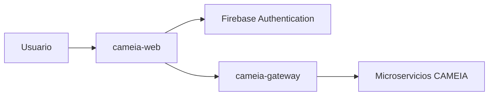

# cameia-web

Aplicación web de CAMEIA para construir el perfil profesional, configurar y realizar entrevistas, y consultar resultados del MVP.

> **Estado al 2026-10-06:** el Sprint 1 está cerrado y el frontend entregado **parcialmente**. Una capacidad solo se considera implementada cuando existe código, pruebas y evidencia.

## Estado del proyecto (2026-10-06)

| Feature                 | Estado                                                                                                    |
| ----------------------- | --------------------------------------------------------------------------------------------------------- |
| `landing`               | Implementada (CM-186): página pública `/`, selector de idioma ES/EN, `<title>` y Open Graph               |
| `auth`                  | Implementada: registro (CM-34), inicio de sesión (CM-40) y cierre de sesión con menú de usuario (CM-194)  |
| `professional-profile`  | Implementada: método de configuración, información general, educación, experiencia, habilidades, roles objetivo, finalizar y autoguardado (CM-46, 53, 61, 65, 69, 195) |
| `interview-setup`       | **Sin construir**: solo páginas placeholder (CM-80, 84, 85, 89, 93 pendientes)                            |
| `interview-session`     | **Sin construir**: solo una página placeholder (CM-31 pendiente)                                          |
| `home`                  | Placeholder (`/inicio`, tablero PRT-00.02 sin historia en el backlog)                                     |

El detalle por subtarea está en [`CLAUDE.md`](CLAUDE.md) §11 y el estado de cada especificación
(`SPEC.md` por feature) en [`docs/SPEC-INDEX.md`](docs/SPEC-INDEX.md).

> **Sobre el backlog.** Hasta la entrega del frontend (2026-10-06) el trabajo se hizo contra versiones
> anteriores del backlog (las que indica el front-matter de cada `SPEC.md`). Existe una versión más
> reciente, `05102026_01_Backlog.xlsx` (v4, con la hoja «Cambios v4»), que llegó después y **no se
> revisó**. El backlog sigue cambiando: antes de tocar una feature, contrasta su `SPEC.md` con la
> versión vigente.

## Alcance

- Interfaces para las historias de Cuentas, Perfil Profesional y Entrevista del MVP.
- Integración de las APIs exclusivamente mediante `cameia-gateway`.

No incluye búsqueda de empleo, persistencia de video ni funcionalidades Post-MVP.

## Responsabilidades

- Presentar los flujos y estados de interacción del usuario.
- Validar entradas en cliente sin sustituir la validación del backend.
- Gestionar la sesión de Firebase según el mecanismo aprobado.
- Consumir contratos publicados por el Gateway.
- Cumplir accesibilidad, manejo de errores y protección de datos en el navegador.

No contiene reglas de negocio de los microservicios ni accede directamente a sus bases de datos.

## Contexto arquitectónico


```mermaid
flowchart LR
    U[Usuario] --> W[cameia-web]
    W --> F[Firebase Authentication]
    W --> G[cameia-gateway]
    G --> S[Microservicios CAMEIA]
```

## Tecnología

| Elemento           | Tecnología                                                          |
| ------------------ | ------------------------------------------------------------------- |
| Interfaz           | React 19, TypeScript 6, Tailwind CSS 4 (tokens, sin `tailwind.config`) |
| Bundler            | Vite 8                                                              |
| Enrutado           | React Router (SPA pura, sin SSR)                                    |
| Datos del servidor | TanStack Query                                                      |
| Estado de cliente  | Zustand                                                             |
| Formularios        | React Hook Form + zod                                               |
| i18n               | i18next (es-CO y en)                                                |
| Pruebas            | Vitest + Testing Library + MSW                                      |
| Runtime            | Node 24 LTS (ver `.nvmrc`)                                          |
| Gestor de paquetes | pnpm 11.25.0 (`packageManager`, gestionado por Corepack)            |
| Despliegue         | Firebase Hosting                                                    |
| Autenticación      | Firebase Authentication                                             |
| Integración        | HTTPS/JSON mediante `cameia-gateway`                                |

Las versiones exactas están en `package.json` y `pnpm-lock.yaml`, que son la fuente de verdad;
la tabla de [`CLAUDE.md`](CLAUDE.md) §2 es una referencia.

La arquitectura completa del frontend — árbol de carpetas, anatomía de una feature, fronteras entre
capas y convenciones de nombres — está documentada en [`docs/ARCHITECTURE.md`](docs/ARCHITECTURE.md).

## Ejecución local

Requiere Node 24.x y Corepack habilitado (`corepack enable`) para que pnpm quede fijado en la
versión declarada en `packageManager`.

```bash
# Instalación
pnpm install

# Variables de entorno (ver la tabla de abajo: faltan los valores de Firebase)
cp .env.example .env

# Desarrollo
pnpm dev
```

### Variables de entorno

Se validan al arrancar con zod en `src/config/env.ts`: si falta una obligatoria, la app no arranca
y el error nombra cuál es. **Los valores de Firebase no están en el repositorio**: el equipo los
entrega aparte; `.env.example` los deja vacíos y `.env` nunca se
versiona.

| Variable                      | ¿Obligatoria?                | Qué es                                                              |
| ----------------------------- | ---------------------------- | ------------------------------------------------------------------- |
| `VITE_APP_NAME`               | Sí                           | Nombre de la app (`CAMEIA`)                                         |
| `VITE_APP_ENV`                | Sí                           | `local`, `staging` o `production`                                   |
| `VITE_FIREBASE_API_KEY`       | Sí                           | Credencial pública del proyecto de Firebase (la entrega el equipo)  |
| `VITE_FIREBASE_AUTH_DOMAIN`   | Sí                           | Ídem                                                                |
| `VITE_FIREBASE_PROJECT_ID`    | Sí                           | Ídem                                                                |
| `VITE_FIREBASE_APP_ID`        | Sí                           | Ídem                                                                |
| `VITE_API_BASE_URL`           | Solo si `VITE_APP_ENV=production` | URL del API Gateway; si falta en local o staging, el cliente no tiene a dónde llamar |
| `VITE_ENABLE_MSW`             | No                           | **Hoy no hace nada**, ver abajo                                     |

### Trabajar sin backend (MSW)

Los mocks de red (`src/mocks/handlers/`) se usan en las **pruebas** (`src/test/setup.ts` levanta
`src/mocks/server.ts`). **No están cableados al navegador**: `src/mocks/browser.ts` no lo importa
nadie, no hay `public/mockServiceWorker.js` y `VITE_ENABLE_MSW=true` no activa nada (`env.enableMsw`
se calcula pero ningún código lo lee). Con `pnpm dev` la app llama al Gateway real de
`VITE_API_BASE_URL`; para trabajar sin backend hay que cablear MSW primero.

### Scripts

| Comando                | Qué hace                                                                       |
| ---------------------- | ------------------------------------------------------------------------------ |
| `pnpm dev`             | Servidor de desarrollo de Vite                                                 |
| `pnpm build`           | `tsc -b` y build de producción                                                 |
| `pnpm preview`         | Sirve el build ya generado                                                     |
| `pnpm typecheck`       | `tsc -b`                                                                       |
| `pnpm lint` · `lint:fix` | ESLint (incluye las fronteras entre capas); `lint:fix` aplica correcciones   |
| `pnpm format` · `format:check` | Prettier: escribe / solo comprueba                                     |
| `pnpm test` · `test:watch` · `test:coverage` | Vitest: una corrida / modo watch / con cobertura         |
| `pnpm spec:check`      | Valida el encabezado y las rutas de los `SPEC.md` (`--write` regenera `docs/SPEC-INDEX.md`) |

### Hook de pre-commit

`pnpm install` ejecuta `prepare` (`husky`) e instala `.husky/pre-commit`, que antes de cada commit
corre `lint-staged` (`prettier --write` y `eslint --fix` solo sobre los archivos del commit, ver
`lint-staged` en `package.json`). Si el hook falla, el commit no se crea: corrige y vuelve a
intentar.

## Configuración y seguridad

- No guardar tokens, credenciales, CV, audio, video ni `.env` en Git.
- Las variables públicas del frontend deben distinguirse de secretos del backend.
- No exponer llamadas directas a microservicios internos.
- Usar datos sintéticos o anonimizados en pruebas y capturas.

## Calidad esperada

- Pruebas de componentes y flujos críticos.
- Validación de accesibilidad en estados estables y de error.
- Antes de abrir un PR: `pnpm typecheck && pnpm lint && pnpm test` y, si tocaste un `SPEC.md`, `pnpm spec:check`.
- Evidencia enlazada desde el Pull Request y Jira.

## Contribución

- Rama estable: `main`.
- Rama de integración: `develop`.
- Ramas de trabajo: `CM-<numero>-<descripcion-kebab-case>`, creadas desde `develop`.
- Los cambios ordinarios entran a `develop` mediante Pull Request y Squash. Se solicita revisión distinta del autor, aunque temporalmente el ruleset exige cero aprobaciones.
- Solo `develop` se promueve a `main`, mediante Pull Request y Merge commit.

## Cuándo actualizar este README

Actualizarlo en el mismo PR que cambie propósito, stack, scripts, variables, rutas públicas, contratos del Gateway, estructura, pruebas, despliegue o responsables. Si el cambio no requiere actualización, justificarlo en la plantilla del PR.
