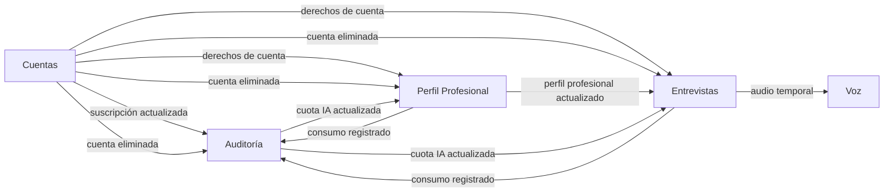

# Glosario del Proyecto CAMEIA — lenguaje ubicuo y dominio

- **Versión:** 3.0
- **Fecha:** 3 de septiembre de 2026
- **Estado:** propuesta validada documentalmente; términos observados y decisiones TBD pendientes de aprobación humana
- **Responsables de validación final:** Product Owner, arquitectura y responsables de cada contexto
- **Alcance:** producto CAMEIA, backlog vigente, Entrega 1 y anexos técnicos
- **Versión anterior preservada:** [`26082026_v2_glosario.md`](../../../prism-uploads/26082026_v2_glosario.md)

## 1. Propósito

Actualizar el glosario v2 y establecer un lenguaje común para backlog, código, APIs, eventos, modelos de datos, pruebas y documentación. Un término solo se considera **validado documentalmente** cuando su significado puede rastrearse al backlog vigente y/o a una fuente arquitectónica o de datos. Esta validación no demuestra que el concepto esté implementado.

Este documento no modifica retroactivamente la Entrega 1. Cuando el backlog vigente difiere de esa entrega, se conserva la diferencia y se marca para decisión humana.

## 2. Método de validación y fuentes

### Estados

| Estado                       | Significado                                                                                                                    |
| ---------------------------- | ------------------------------------------------------------------------------------------------------------------------------ |
| **Validado**                 | El término tiene significado coherente en el backlog vigente y en al menos una fuente arquitectónica o de datos.               |
| **Validado con observación** | El concepto existe y su núcleo es claro, pero hay diferencias de nombre, cardinalidad, estado o responsabilidad entre fuentes. |
| **Post-MVP**                 | El concepto está reconocido, pero no debe tratarse como capacidad implementable dentro del MVP vigente.                        |
| **TBD**                      | Falta una decisión que cambia materialmente su definición o sus reglas.                                                        |
| **Retirado o reemplazado**   | El término pertenecía a la v2, pero contradice el backlog o la arquitectura vigente y no debe utilizarse en trabajo nuevo.     |

### Fuentes

| Código    | Fuente                                                                                                                                             | Autoridad utilizada                                                                             |
| --------- | -------------------------------------------------------------------------------------------------------------------------------------------------- | ----------------------------------------------------------------------------------------------- |
| `BL`      | [`30082026_01_Backlog.xlsx`](../../../30082026_01_Backlog.xlsx), actualizado en el workspace el 3-sep-2026                                         | Alcance, épicas, historias y criterios vigentes.                                                |
| `E1`      | [`Cameia_Entrega1_Grupo4.pdf`](../../../estáticos/Entrega1/Cameia_Entrega1_Grupo4.pdf)                                                             | Declaración histórica del producto y arquitectura.                                              |
| `STACK`   | [`25082026_01_StackTecnologias.docx`](../../../estáticos/Entrega1/25082026_01_StackTecnologias.docx)                                               | Selecciones tecnológicas históricas; requieren reconfirmación antes de implementar o contratar. |
| `ER`      | [`Anexo_Tecnico_ER.pdf`](../../../estáticos/Entrega1/Anexos_Entrega1_Grupo4/Anexos_Entrega1_Grupo4/Anexo_Tecnico_ER.pdf) y anexos E/R por contexto | Responsabilidad, relaciones, invariantes y contratos históricos.                                |
| `DDL-CUE` | [`30082026_v1_DDL_MicroCuentas.sql`](../../../estáticos/Entrega1/30082026_v1_DDL_MicroCuentas.sql)                                                 | Modelo físico histórico de Cuentas.                                                             |
| `DDL-PER` | [`30082026_v1_DDL_MicroPerfilPro.sql`](../../../estáticos/Entrega1/30082026_v1_DDL_MicroPerfilPro.sql)                                             | Modelo físico histórico de Perfil Profesional.                                                  |
| `DDL-ENT` | [`30082026_v1_DDL_MicroEntrevistas.sql`](../../../estáticos/Entrega1/30082026_v1_DDL_MicroEntrevistas.sql)                                         | Modelo físico histórico de Entrevistas.                                                         |
| `DDL-AUD` | [`30082026_v1_DDL_MicroAuditoria.sql`](../../../estáticos/Entrega1/30082026_v1_DDL_MicroAuditoria.sql)                                             | Modelo físico histórico de Auditoría.                                                           |
| `GLO-v2`  | [`26082026_v2_glosario.md`](../../../prism-uploads/26082026_v2_glosario.md)                                                                        | Glosario anterior utilizado para comprobar continuidad, cambios y términos retirados.           |

Regla de precedencia: `BL` expresa el alcance vivo. `GLO-v2`, `E1`, `ER` y los DDL demuestran lo definido anteriormente, pero una diferencia con el backlog no se resuelve silenciosamente a favor de ninguna fuente.

## 3. Mapa de contextos DDD

| Contexto o componente  | Responsabilidad en el lenguaje ubicuo                                                                             | No posee                                                                     | Validación                                                                           |
| ---------------------- | ----------------------------------------------------------------------------------------------------------------- | ---------------------------------------------------------------------------- | ------------------------------------------------------------------------------------ |
| **Cuentas**            | Cuenta local, plan, suscripción, pagos, derechos y límite nominal del ciclo.                                      | Consumo acumulado, perfiles profesionales o entrevistas.                     | `BL` HE-01/HE-08/HE-09; `ER`; `DDL-CUE` — **Validado**.                              |
| **Perfil Profesional** | Perfiles profesionales, experiencia, educación, habilidades, roles objetivo y revisión de datos asistidos por IA. | Credenciales, pagos, sesiones de entrevista o ledger de consumo.             | `BL` HE-02; `ER`; `DDL-PER` — **Validado**.                                          |
| **Entrevistas**        | Configuración y ejecución de sesiones, preguntas, turnos, intentos, feedback, evaluación y reportes.              | Cuenta maestra, perfil maestro, pagos o audio permanente.                    | `BL` HE-04 a HE-07; `ER`; `DDL-ENT` — **Validado**.                                  |
| **Auditoría**          | Ledger funcional de consumo y costo de IA, acumulado por ciclo y estado operativo de cuota.                       | Credenciales, plan comercial maestro o trazas técnicas como fuente contable. | `BL` HE-09; `ER`; `DDL-AUD` — **Validado**.                                          |
| **Voz**                | Transcripción y cálculo técnico de métricas acústicas/prosódicas.                                                 | Audio permanente, cuenta, perfil, entrevista o reporte maestro.              | `BL` HU-5.8 y HU-6.1/6.2; `E1` — **Validado con observación**: no existe DDL propio. |
| **Empleo**             | Oferta estructurada, sugerencias externas, compatibilidad y ruta de mejora.                                       | Capacidades activas del MVP.                                                 | `BL` HE-03/HU-3.*; `E1`; `ER` — **Post-MVP**.                                        |
| **Cliente Web**        | Interfaz y coordinación de la experiencia del usuario.                                                            | Reglas de negocio autoritativas.                                             | `BL`; `E1` — **Validado** como componente, no como Bounded Context.                  |
| **API Gateway**        | Entrada HTTP, autenticación transversal y enrutamiento.                                                           | Agregados o persistencia de negocio.                                         | `E1` — **Validado** como componente técnico, no como Bounded Context.                |

Las flechas representan intercambio mediante contratos o eventos; no autorizan claves foráneas, consultas ni transacciones entre bases de contextos diferentes.

## 4. Actores y responsabilidades externas

| Concepto      | Definición aplicable a CAMEIA                                                                                           | Relación                                                                                 | Fuente y estado                                                                                             |
| ------------- | ----------------------------------------------------------------------------------------------------------------------- | ---------------------------------------------------------------------------------------- | ----------------------------------------------------------------------------------------------------------- |
| Invitado      | Persona sin sesión autenticada que puede registrarse o iniciar sesión.                                                  | Al registrarse origina una identidad Firebase y una Cuenta con Plan Gratis.              | `BL` HE-01; `E1`; `GLO-v2` — **Validado**.                                                                  |
| Usuario       | Persona que utiliza CAMEIA y puede actuar autenticada sobre su Cuenta, Perfiles Profesionales y Sesiones de Entrevista. | No debe utilizarse como nombre de tabla o agregado sin precisar el contexto propietario. | `BL`; `E1`; `GLO-v2` — **Validado con observación**.                                                        |
| Product Owner | Rol del equipo que prioriza backlog y decide reglas de producto.                                                        | No es un actor funcional de CAMEIA ni una entidad del dominio.                           | `GLO-v2`; documentación académica — **Validado**.                                                           |
| Reclutador    | Audiencia de referencia para comprender algunas métricas laborales.                                                     | No tiene cuenta, permisos ni casos de uso propios en el alcance vigente.                 | `GLO-v2`; ausencia de HU propias en `BL` — **Validado con observación**: no modelar como actor del sistema. |

## 5. Conceptos DDD transversales

| Concepto                              | Definición aplicable a CAMEIA                                                    | Relación                                                                                        | Fuente y estado                                                                                              |
| ------------------------------------- | -------------------------------------------------------------------------------- | ----------------------------------------------------------------------------------------------- | ------------------------------------------------------------------------------------------------------------ |
| Dominio                               | Problema de preparación y práctica de entrevistas laborales asistidas por IA.    | Contiene los subdominios de cuenta, perfil, entrevista, evaluación y control de consumo.        | `BL`, `E1` — **Validado**.                                                                                   |
| Subdominio                            | Área coherente de capacidad del negocio.                                         | Se implementa dentro de un contexto o se apoya en un servicio técnico.                          | `BL` HE-01 a HE-09 — **Validado**.                                                                           |
| Lenguaje ubicuo                       | Vocabulario compartido usado con el mismo significado por negocio y tecnología.  | Este glosario es su registro controlado.                                                        | DDD aplicado en `E1`; términos contrastados con `BL` — **Validado**.                                         |
| Bounded Context o contexto delimitado | Límite donde un modelo, sus reglas y su vocabulario tienen significado propio.   | Cuentas, Perfil Profesional, Entrevistas y Auditoría poseen datos y autoridad separados.        | `E1`, `ER` — **Validado**.                                                                                   |
| Context Map                           | Vista de dependencias y contratos entre contextos.                               | Se expresa en el mapa de la sección 3.                                                          | Inferido de eventos de `ER`, contrastado con `BL` — **Validado documentalmente**.                            |
| Agregado                              | Conjunto de entidades y objetos de valor que cambia bajo reglas consistentes.    | Se modifica a través de su raíz.                                                                | `E1`, `ER` — **Validado**.                                                                                   |
| Aggregate Root o raíz de agregado     | Entidad que controla las invariantes y acceso al agregado.                       | Ejemplos: Cuenta/Suscripción, Contexto Profesional, Sesión de Entrevista y Consumo por Periodo. | `E1`, `ER` — **Validado con observación**: Cuentas posee más de una raíz.                                    |
| Entidad                               | Objeto con identidad estable y ciclo de vida.                                    | Sesión, Turno, Suscripción y Perfil Profesional son entidades.                                  | `E1`, `ER`, DDL — **Validado**.                                                                              |
| Objeto de valor                       | Concepto definido por sus atributos y reglas, no por identidad independiente.    | Modalidad, configuración o referencia opaca pueden modelarse como objetos de valor en código.   | `E1` modelo de clases — **Validado con observación**: el DDL puede representarlos como columnas o catálogos. |
| Invariante                            | Regla que siempre debe cumplirse dentro del agregado.                            | Una sesión no inicia sin perfil válido; un turno tiene como máximo un intento definitivo.       | `BL`, `ER`, `DDL-ENT` — **Validado**.                                                                        |
| Servicio de dominio                   | Comportamiento de negocio que no pertenece naturalmente a una sola entidad.      | Planificación, política de cuota o evaluación pueden expresarse como servicios/políticas.       | `E1` — **Validado con observación**: los nombres finales en código siguen pendientes.                        |
| Servicio de aplicación                | Coordina un caso de uso sin contener la regla principal del dominio.             | Recibe una solicitud, carga el agregado, invoca dominio y persiste/publica.                     | Arquitectura en capas de `E1` — **Validado**.                                                                |
| Repositorio de dominio                | Abstracción para recuperar y guardar agregados.                                  | No debe confundirse con un repositorio Git.                                                     | Arquitectura DDD de `E1` — **Validado**.                                                                     |
| Evento de dominio                     | Hecho pasado relevante publicado por el contexto que lo posee.                   | Ejemplos: perfil profesional actualizado, consumo registrado y suscripción actualizada.         | `ER`, DDL — **Validado**.                                                                                    |
| Read Model o proyección               | Copia local mínima derivada de información autoritativa de otro contexto.        | Entrevistas replica Perfil, derechos y cuota sin convertirse en su propietario.                 | `ER`, `DDL-PER`, `DDL-ENT` — **Validado**.                                                                   |
| Referencia opaca                      | Identificador externo almacenado sin FK ni acceso directo a la base originaria.  | `firebaseUid`, `usuario_ref` o `contexto_profesional_ref`.                                      | `E1`, `ER`, DDL — **Validado**.                                                                              |
| Consistencia eventual                 | Los contextos convergen después de recibir eventos, sin transacción distribuida. | Puede existir retraso acotado entre consumo y actualización de cuota.                           | `E1`, `ER` — **Validado**.                                                                                   |
| Idempotencia                          | Repetir una operación o mensaje no produce efectos adicionales.                  | Evita pagos, consumo o eventos duplicados.                                                      | `BL`, `ER`, DDL — **Validado**.                                                                              |
| Outbox                                | Registro transaccional de eventos pendientes de publicación.                     | Conserva cambio de negocio y evento en una misma transacción local.                             | `E1`, `ER`, DDL — **Validado**.                                                                              |
| Inbox o mensaje procesado             | Registro local utilizado para rechazar la reentrega de un evento ya aplicado.    | Complementa la idempotencia del consumidor.                                                     | `E1`, `ER`, DDL — **Validado**.                                                                              |
| Fuente de verdad                      | Contexto que tiene autoridad para decidir y modificar un dato.                   | Otros contextos solo mantienen referencias o proyecciones.                                      | `ER` — **Validado**.                                                                                         |

## 6. Lenguaje de negocio por contexto

### 6.1 Identidad y Cuentas

| Concepto              | Definición y relaciones                                                                                                                  | Fuente y estado                                                                                        |
| --------------------- | ---------------------------------------------------------------------------------------------------------------------------------------- | ------------------------------------------------------------------------------------------------------ |
| Invitado              | Persona que aún no posee una sesión autenticada y puede registrarse o iniciar sesión.                                                    | `BL` HE-01/HU-1.1/HU-1.10; `E1` — **Validado**.                                                        |
| Usuario               | Actor que utiliza CAMEIA. Cuando se habla de persistencia debe precisarse si se refiere a Cuenta, identidad Firebase o referencia opaca. | `BL`, `E1` — **Validado con observación** por uso genérico.                                            |
| Cuenta                | Registro local que enlaza la identidad Firebase con datos personales mínimos, estado y versión. No almacena contraseñas.                 | `BL` HU-1.*; `ER`; `DDL-CUE` — **Validado**.                                                           |
| Identidad Firebase    | Identidad y credenciales administradas por Firebase Authentication.                                                                      | Se referencia mediante `firebaseUid`; Cuentas conserva el registro local.                              | `BL` HU-1.*; `ER` — **Validado**.                      |
| Plan                  | Oferta comercial que define precio y capacidades nominales.                                                                              | Puede ser Gratis o Premium y se materializa mediante una suscripción.                                  | `BL` HE-08; `ER`; `DDL-CUE` — **Validado**.            |
| Plan Gratis           | Plan asignado automáticamente a una cuenta nueva, con un Perfil Profesional y acceso limitado a análisis.                                | `BL` HE-01/HE-02/HE-06; `DDL-CUE` — **Validado**.                                                      |
| Plan Premium          | Plan con derechos ampliados, incluidos múltiples Perfiles Profesionales y análisis/recomendaciones adicionales.                          | `BL` HE-02/HE-06/HE-08 — **Validado con observación**: multiplicadores y detalle comercial siguen TBD. |
| Suscripción           | Relación temporal entre una Cuenta y una tarifa/plan contratado.                                                                         | Determina derechos vigentes y ciclo de facturación.                                                    | `BL` HE-08; `ER`; `DDL-CUE` — **Validado**.            |
| Derecho o entitlement | Capacidad efectiva derivada de la suscripción, por ejemplo cantidad máxima de perfiles.                                                  | Perfil y Entrevistas consumen proyecciones; no recalculan el plan.                                     | `BL`, `ER`, `DDL-PER`, `DDL-ENT` — **Validado**.       |
| Límite nominal        | Máximo de consumo definido por el plan para un ciclo.                                                                                    | Cuentas lo posee; Auditoría combina el límite con el consumo acumulado.                                | `ER`; `DDL-CUE`, `DDL-AUD` — **Validado**.             |
| Ciclo de facturación  | Intervalo de vigencia utilizado para suscripción, límite y acumulación de consumo.                                                       | Relaciona Cuentas con Consumo por Periodo.                                                             | `BL` HE-09; `ER`; DDL — **Validado**.                  |
| Pago                  | Resultado económico procesado por Wompi y registrado sin almacenar datos sensibles reutilizables.                                        | Puede activar o actualizar una suscripción.                                                            | `BL` HU-8.*; `ER`; `DDL-CUE` — **Validado**, Sprint 3. |
| Custom Claim de plan  | Dato mínimo del plan publicado en Firebase para autorización rápida.                                                                     | No sustituye la Suscripción ni los derechos autoritativos.                                             | `BL` HE-08; `ER`; `DDL-CUE` — **Validado**.            |

### 6.2 Perfil Profesional

| Concepto                                  | Definición y relaciones                                                                                                                               | Fuente y estado                                                                                                                                                    |
| ----------------------------------------- | ----------------------------------------------------------------------------------------------------------------------------------------------------- | ------------------------------------------------------------------------------------------------------------------------------------------------------------------ |
| Perfil Profesional o Contexto Profesional | Agregado que representa una versión independiente del contexto laboral de una persona: resumen, experiencia, educación, habilidades y roles objetivo. | `BL` HE-02; `E1`; `ER`; `DDL-PER` — **Validado**. En lenguaje de usuario se prefiere **Perfil Profesional**; `contexto_profesional` es el nombre físico histórico. |
| Perfil personal o datos de cuenta         | Información personal de la Cuenta, como nombre o pronombres.                                                                                          | No es sinónimo de Perfil Profesional.                                                                                                                              | `BL` HU-1.5/HU-1.6 frente a HU-2.* — **Validado con observación**.                                                    |
| Multi-Perfil                              | Capacidad de una Cuenta para mantener varios Perfiles Profesionales independientes.                                                                   | Gratis permite uno; Premium permite múltiples.                                                                                                                     | `BL` HE-02/HU-2.12; `DDL-PER` `entitlements_perfil` — **Validado**.                                                   |
| Perfil activo                             | Perfil Profesional seleccionado para iniciar una operación core.                                                                                      | Premium debe seleccionar uno cuando existen varios.                                                                                                                | `BL` CA-2.12.3 — **Validado con observación**: falta definir si “activo” es selección temporal o estado persistente.  |
| Borrador de perfil                        | Perfil Profesional todavía incompleto y editable.                                                                                                     | Corresponde normalmente a `IN_PROGRESS`.                                                                                                                           | `BL` HU-2.2/2.3; `DDL-PER` — **Validado**.                                                                            |
| Perfil completo                           | Perfil Profesional en estado `COMPLETED`, no archivado y apto para módulos core.                                                                      | Es precondición de una Sesión de Entrevista.                                                                                                                       | `BL` HU-2.1/HU-4.2; `ER`; `DDL-PER` — **Validado**.                                                                   |
| Experiencia laboral                       | Trayectoria de trabajo perteneciente a un Perfil Profesional.                                                                                         | Puede ser actual, finalizada o con fin desconocido.                                                                                                                | `BL` HU-2.4; `DDL-PER` — **Validado**.                                                                                |
| Educación                                 | Formación académica perteneciente a un Perfil Profesional.                                                                                            | Participa en la completitud del perfil según el anexo histórico.                                                                                                   | `BL` HU-2.4; `ER`; `DDL-PER` — **Validado**.                                                                          |
| Habilidad                                 | Capacidad profesional normalizada que se asocia a un Perfil Profesional.                                                                              | No debe duplicarse semánticamente dentro del mismo perfil.                                                                                                         | `BL` HU-2.5; `ER`; `DDL-PER` — **Validado**.                                                                          |
| Rol profesional                           | Término normalizado del catálogo de ocupaciones o funciones profesionales.                                                                            | Puede ser canónico, sugerido o creado por usuario.                                                                                                                 | `BL` HU-2.10/2.11; `DDL-PER` — **Validado**.                                                                          |
| Rol Objetivo                              | Rol profesional priorizado dentro de un Perfil Profesional para orientar práctica y análisis.                                                         | Una Sesión conserva una copia del rol elegido.                                                                                                                     | `BL` HE-02/HE-04; `ER`; `DDL-PER`, `DDL-ENT` — **Validado**.                                                          |
| Hoja de Vida (CV)                         | Documento aportado por el usuario como insumo temporal para completar un Perfil Profesional.                                                          | No es el Perfil Profesional ni debe conservarse después del cierre de la importación.                                                                              | `BL` HU-2.6 a HU-2.8; `ER`; `GLO-v2` — **Validado**. Primera mención: “Hoja de Vida (CV)”; después puede usarse “CV”. |
| Importación de CV                         | Proceso temporal que recibe un CV, extrae texto y produce un borrador estructurado para revisión.                                                     | El archivo y contenido temporal se eliminan al cerrar el proceso.                                                                                                  | `BL` HU-2.6 a HU-2.8; `ER`; `DDL-PER` — **Validado**.                                                                 |
| Procedencia del dato                      | Marca que explica cómo se originó un campo: `MANUAL`, `AI_SUGGESTED` o `AI_EDITED`.                                                                   | Permite trazabilidad y revisión HITL.                                                                                                                              | `BL` HE-02; `DDL-PER` — **Validado**.                                                                                 |
| Revisión humana del perfil                | Aceptación, edición o rechazo explícito de información producida por IA antes de persistirla como definitiva.                                         | Cambia la procedencia y conserva evidencia mínima.                                                                                                                 | `BL` HU-2.8; `ER`; `DDL-PER` — **Validado**.                                                                          |
| Feature Gate o Soft Block                 | Control que permite navegar, pero exige un Perfil Profesional completo al ingresar a un módulo core.                                                  | No bloquea globalmente la plataforma.                                                                                                                              | `BL` HU-2.1 — **Validado**.                                                                                           |

### 6.3 Entrevistas y evaluación

| Concepto                     | Definición y relaciones                                                                                                                | Fuente y estado                                                                            |
| ---------------------------- | -------------------------------------------------------------------------------------------------------------------------------------- | ------------------------------------------------------------------------------------------ |
| Sesión de Entrevista         | Aggregate Root que congela el Perfil Profesional, Oferta Laboral, Rol Objetivo y personalización usados en una práctica.               | Contiene preguntas planificadas, turnos, intentos y evaluación.                            | `BL` HE-04/HE-05; `E1`; `ER`; `DDL-ENT` — **Validado**.                                                               |
| Configuración de Sesión      | Conjunto requerido para iniciar: perfil, rol, modalidad, tono, personalidad, forma de respuesta e idioma; la oferta es texto opcional. | Se valida antes de crear/iniciar la sesión.                                                | `BL` HU-4.2 a HU-4.4; `ER`; `DDL-ENT` — **Validado**.                                                                 |
| Idioma de Entrevista         | Idioma seleccionado para la interacción de una Sesión de Entrevista.                                                                   | El backlog vigente lo presenta disponible para todos los planes.                           | `BL` HE-04/CA-4.3.5; `DDL-ENT` — **Validado con observación**: reemplaza la restricción Premium descrita en `GLO-v2`. |
| Oferta Laboral del MVP       | Texto libre opcional que contextualiza una Sesión de Entrevista.                                                                       | No es una entidad administrada por Entrevistas ni equivale al futuro contexto Empleo.      | `BL` HU-4.2/CA-4.2.4; `ER`; `DDL-ENT` — **Validado**.                                                                 |
| Modalidad o modo             | Regla de interacción de una sesión: `ENTRENO` o `SIMULACION`.                                                                          | Modifica feedback, repreguntas y reintentos funcionales.                                   | `BL` HE-05; `DDL-ENT` — **Validado**. Se recomienda usar **Modalidad** en modelo y **Modo** en interfaz.              |
| Modo Entreno                 | Modalidad con feedback inmediato y acciones pedagógicas de aclaración o reintento.                                                     | Cada turno completado requiere feedback según el modelo histórico.                         | `BL` HU-5.2 a HU-5.4; `ER`; `DDL-ENT` — **Validado**.                                                                 |
| Modo Simulación              | Modalidad continua sin feedback visible durante la sesión.                                                                             | El feedback se consolida y muestra al finalizar.                                           | `BL` HU-5.2/HU-5.5; `ER`; `DDL-ENT` — **Validado**.                                                                   |
| Pregunta planificada         | Pregunta base creada para una sesión antes o durante su planificación.                                                                 | Origina un Turno y conserva orden dentro de la sesión.                                     | `BL` HU-4.5; `ER`; `DDL-ENT` — **Validado con observación** por diferencia de cantidad.                               |
| Pregunta mostrada            | Formulación efectiva presentada al usuario, que puede adaptarse al contexto.                                                           | Debe persistirse antes de recibir la respuesta.                                            | `BL` HU-5.2; `ER`; `DDL-ENT` — **Validado**.                                                                          |
| Turno de Entrevista          | Unidad ordenada de interacción asociada con una pregunta mostrada.                                                                     | Agrupa intentos de respuesta y, en Entreno, feedback.                                      | `BL` HU-5.2; `ER`; `DDL-ENT` — **Validado**.                                                                          |
| Intento de respuesta         | Respuesta textual o transcripción perteneciente a un Turno.                                                                            | Se conservan los intentos y como máximo uno es definitivo.                                 | `BL` HU-5.4/HU-5.8; `ER`; `DDL-ENT` — **Validado**.                                                                   |
| Repregunta o aclaración      | Reformulación de la pregunta actual sin consumir un nuevo Turno.                                                                       | Solo se permite en Modo Entreno.                                                           | `BL` HU-5.3 — **Validado**.                                                                                           |
| Reintento funcional          | Nueva respuesta iniciada por el usuario después del feedback.                                                                          | Crea otro Intento de respuesta en el mismo Turno; solo la definitiva alimenta el contexto. | `BL` HU-5.4; `DDL-ENT` — **Validado**.                                                                                |
| Reintento técnico            | Nueva invocación automática ante un fallo transitorio de un proveedor.                                                                 | No equivale a una nueva respuesta del usuario.                                             | `BL` CA-2.7.3, HU-5.6 y CA-5.8.2 — **Validado**; máximo actual indicado: tres intentos técnicos.                      |
| Contexto Conversacional      | Información mínima de la sesión y de interacciones previas utilizada para mantener coherencia y adaptar preguntas.                     | Se reconstruye desde estado persistido; no debe depender solo de memoria.                  | `BL` HU-5.1/HU-5.2/HU-5.7; `E1` — **Validado con observación**: estrategia y presupuesto siguen en Spike/TBD.         |
| Motor de Entrevista          | Comportamiento del dominio que coordina modalidad, estado, planificación, turnos, feedback y recuperación.                             | No es sinónimo del microservicio completo.                                                 | `BL` HE-05; `E1` — **Validado**.                                                                                      |
| Máquina de estados de sesión | Reglas que determinan las transiciones válidas de una Sesión de Entrevista.                                                            | Debe persistirse para recuperar una sesión sin duplicar turnos.                            | `BL` HU-5.7; `ER`; `DDL-ENT` — **Validado con observación** por catálogo no reconciliado.                             |
| Feedback                     | Retroalimentación asociada con una respuesta/turno.                                                                                    | Visible inmediatamente en Entreno y diferida en Simulación.                                | `BL` HE-05/HU-5.2/HU-5.5; `DDL-ENT` — **Validado**.                                                                   |
| Reporte de Evaluación        | Resultado persistido e inmutable generado para una sesión finalizada, con métricas y hallazgos.                                        | Existe como máximo uno por Sesión.                                                         | `BL` HE-06; `E1`; `ER`; `DDL-ENT` — **Validado**.                                                                     |
| Métrica acústica             | Medición derivada del audio, como vacilación, ritmo, F0 o pausas.                                                                      | No aplica a respuestas exclusivamente textuales; ausencia no significa cero.               | `BL` HE-06/HU-6.2; `E1` — **Validado**.                                                                               |
| Métrica semántica            | Evaluación del contenido, como precisión, claridad, carisma verbal o lenguaje inclusivo y adecuado.                                    | Puede aplicar a texto y transcripción.                                                     | `BL` HE-06/HU-6.2 — **Validado con observación**: escalas y umbrales siguen TBD.                                      |
| Método STAR                  | Marco Situación–Tarea–Acción–Resultado aplicado únicamente a preguntas conductuales o de experiencia pasada.                           | Produce un resultado dentro del Reporte de Evaluación.                                     | `BL` HE-06/HU-6.3; `ER`; `DDL-ENT` — **Validado**.                                                                    |
| Hallazgo                     | Observación evaluativa respaldada por evidencia de uno o varios turnos.                                                                | Puede relacionarse con una debilidad y su evolución.                                       | `E1`; `ER`; `DDL-ENT` — **Validado con observación**: falta vocabulario funcional detallado en `BL`.                  |
| Reporte de Progreso General  | Agregación histórica de Reportes de Evaluación para mostrar evolución transversal.                                                     | No modifica los reportes fuente.                                                           | `BL` HE-07/HU-7.1; `E1` — **Validado**, Sprint 3.                                                                     |
| Reporte de Progreso por Rol  | Evolución histórica filtrada o ponderada por Rol Objetivo.                                                                             | Depende de varios Reportes de Evaluación.                                                  | `BL` HU-7.2 — **Validado con observación**: origen exacto del rol y ponderación son TBD.                              |
| Ruta de Mejora o Upskilling  | Recomendación de habilidades derivada de comparar el perfil con una Oferta Laboral.                                                    | Pertenece a HE-03 y depende del futuro contexto Empleo.                                    | `BL` HU-3.3; `E1`; `GLO-v2` — **Post-MVP**.                                                                           |

### 6.4 Auditoría y consumo de IA

| Concepto              | Definición y relaciones                                                                       | Fuente y estado                                                                    |
| --------------------- | --------------------------------------------------------------------------------------------- | ---------------------------------------------------------------------------------- |
| Ejecución de IA       | Invocación identificada a una capacidad de IA, asociada con un contexto, operación e intento. | Origina consumo y trazabilidad técnica.                                            | `BL`; `ER`; DDL — **Validado**.              |
| Evento de consumo     | Hecho inmutable que registra tokens/costo asociados con una ejecución de IA.                  | Se incorpora una sola vez al ledger.                                               | `BL` HU-9.1; `ER`; `DDL-AUD` — **Validado**. |
| Ledger de consumo     | Historial funcional de solo anexado que permite reproducir la contabilización.                | Langfuse no lo sustituye.                                                          | `ER`; `DDL-AUD` — **Validado**.              |
| Consumo por Periodo   | Aggregate Root que acumula consumo para un usuario y ciclo.                                   | Combina límite nominal, tokens consumidos y estado de cuota.                       | `BL` HE-09; `ER`; `DDL-AUD` — **Validado**.  |
| Cuota de IA           | Estado operativo que determina si puede comenzar una nueva ejecución de IA.                   | Utiliza `OK`, `ALERTA` o `BLOQUEADO`.                                              | `BL` HE-09; `ER`; `DDL-AUD` — **Validado**.  |
| Estado `BLOQUEADO`    | Cuota que impide iniciar la siguiente ejecución de IA.                                        | Una llamada ya iniciada puede terminar antes de aplicar la proyección actualizada. | `BL` CA-4.4.4/HU-9.3; `ER` — **Validado**.   |
| Multiplicador Premium | Parámetro aplicado al límite base para calcular el límite de un Plan Premium.                 | No debe estar hardcodeado.                                                         | `BL` HU-9.2 — **TBD**: falta valor aprobado. |
| Langfuse              | Herramienta de observabilidad de interacciones con IA.                                        | Mantiene trazas técnicas; Auditoría conserva el ledger y estado de cuota.          | `BL` HU-9.1; `E1`; `ER` — **Validado**.      |

### 6.5 Estados y códigos controlados

| Concepto                       | Valores documentados                                                                                                                                                        | Regla y validación                                                                                                     |
| ------------------------------ | --------------------------------------------------------------------------------------------------------------------------------------------------------------------------- | ---------------------------------------------------------------------------------------------------------------------- |
| Estado de Perfil Profesional   | `PENDING`, `IN_PROGRESS`, `IN_REVIEW`, `COMPLETED`                                                                                                                          | `BL`, `ER` y `DDL-PER` — **Validado**. El archivado es una condición separada, no otro estado funcional.               |
| Procedencia del dato           | `MANUAL`, `AI_SUGGESTED`, `AI_EDITED`                                                                                                                                       | `BL` y `DDL-PER` — **Validado**.                                                                                       |
| Estado de Importación de CV    | `RECEIVED`, `EXTRACTING`, `READY_FOR_REVIEW`, `APPLIED`, `REJECTED`, `FAILED`, `EXPIRED`                                                                                    | `DDL-PER`, contrastado con HU-2.6 a HU-2.8 — **Validado documentalmente**.                                             |
| Modalidad de entrevista        | `ENTRENO`, `SIMULACION`                                                                                                                                                     | `BL` y `DDL-ENT` — **Validado**. Las etiquetas de UI pueden llevar tilde; los códigos no.                              |
| Estado de Sesión de Entrevista | Núcleo coincidente: `CONFIGURADA`, `EN_CURSO`, `EVALUANDO`, `FINALIZADA`, `ABANDONADA`; el DDL histórico añade `PAUSADA_USUARIO`, `SUSPENDIDA_CUOTA`, `SUSPENDIDA_TECNICA`. | **Validado con observación**; el catálogo definitivo depende de `GLO-TBD-02`.                                          |
| Estado de Turno                | `PENDING`, `PROCESSING`, `COMPLETED`, `RETRYING`, `FAILED`                                                                                                                  | `BL` HU-5.2 y `DDL-ENT` — **Validado**.                                                                                |
| Origen de intento              | `INICIAL`, `REPREGUNTA`, `REINTENTO_USUARIO`                                                                                                                                | `BL` HU-5.3/HU-5.4 y `DDL-ENT` — **Validado**. No incluye reintentos técnicos.                                         |
| Forma de respuesta             | `TEXTO`, `AUDIO`; Video fuera del MVP                                                                                                                                       | `BL` HE-04/HU-5.8 y `DDL-ENT` — **Validado con observación**: confirmar los códigos exactos antes de exponer contrato. |
| Estado de cuota de IA          | `OK`, `ALERTA`, `BLOQUEADO`                                                                                                                                                 | `BL`, `ER`, `DDL-AUD`, `DDL-PER` y `DDL-ENT` — **Validado**.                                                           |

## 7. Componentes, integraciones y tecnologías

Estos términos explican la arquitectura que soporta el dominio. Una tecnología documentada no se considera implementada únicamente por aparecer en este glosario.

| Concepto                      | Definición y relación con el dominio                                                                                 | Fuente y estado                                                                                                                              |
| ----------------------------- | -------------------------------------------------------------------------------------------------------------------- | -------------------------------------------------------------------------------------------------------------------------------------------- |
| Cliente Web                   | Aplicación usada por Invitados y Usuarios; presenta los casos de uso y consume el API Gateway.                       | `BL`; `E1`; `STACK`; `GLO-v2` — **Validado** como componente, no como contexto DDD.                                                          |
| API Gateway                   | Punto de entrada HTTP que verifica identidad, aplica controles transversales y enruta hacia el contexto responsable. | `E1`; `GLO-v2` — **Validado**; no contiene lógica de negocio autoritativa.                                                                   |
| Gateway LLM                   | Nombre histórico de la capa de acceso a proveedores de modelos dentro de Entrevistas.                                | `BL` HU-5.*; `STACK`; `GLO-v2` — **Validado con observación**: el nombre colisiona con API Gateway y requiere decisión `GLO-TBD-04`.         |
| Proveedor LLM                 | Servicio externo que procesa una solicitud de lenguaje mediante un adaptador controlado.                             | Entrevistas y Perfil invocan capacidades; Auditoría recibe el consumo.                                                                       | `BL`; `E1` — **Validado** como término genérico.                                                      |
| Servicio de Voz               | Componente Python/FastAPI para transcripción y métricas acústicas o prosódicas.                                      | Entrevistas envía audio temporal y recibe transcripción/resultados.                                                                          | `BL` HU-5.8/HU-6.1; `E1`; `STACK`; `GLO-v2` — **Validado con observación**: implementación pendiente. |
| Firebase Authentication       | Proveedor de identidad y credenciales.                                                                               | Cuentas conserva la Cuenta local enlazada mediante `firebaseUid`.                                                                            | `BL` HU-1.*; `E1`; `STACK`; `GLO-v2` — **Validado**.                                                  |
| Firebase App Check            | Control técnico propuesto para reducir solicitudes desde clientes no legítimos.                                      | Protege endpoints, pero no reemplaza autenticación ni autorización.                                                                          | `STACK`; `GLO-v2` — **Validado con observación**: no aparece como criterio vigente de `BL`.           |
| React 19                      | Tecnología prevista para el Cliente Web.                                                                             | `STACK`; `E1`; `GLO-v2` — **Validado documentalmente**; implementación no comprobada.                                                        |
| Java 21 y Spring Boot         | Línea base prevista para Gateway y microservicios Java.                                                              | `STACK`; `E1`; `GLO-v2` — **Validado documentalmente**; implementación no comprobada.                                                        |
| Python y FastAPI              | Línea base prevista para el Servicio de Voz.                                                                         | `E1`; `GLO-v2` — **Validado documentalmente**; implementación no comprobada.                                                                 |
| Cloud Run                     | Plataforma objetivo para contenedores de aplicación; no determina los límites DDD.                                   | `STACK`; `E1`; `GLO-v2` — **Validado documentalmente**; despliegue no comprobado.                                                            |
| Cloud SQL PostgreSQL          | Persistencia relacional objetivo con base y rol separados por contexto.                                              | `STACK`; `E1`; `ER` — **Validado documentalmente**; despliegue no comprobado.                                                                |
| RabbitMQ                      | Broker previsto para eventos entre contextos mediante Outbox/Inbox y colas por consumidor.                           | `E1`; `ER`; DDL — **Validado** arquitectónicamente; ejecución pendiente. La discrepancia abierta en `GLO-v2` quedó resuelta en la Entrega 1. |
| Wompi                         | Proveedor externo de pagos; Cuentas valida webhooks y registra transacciones y suscripciones.                        | `BL` HU-8.*; `E1`; `STACK`; `GLO-v2` — **Validado**, funcionalidad Sprint 3.                                                                 |
| Langfuse                      | Plataforma de observabilidad de llamadas de IA; no es el Microservicio de Auditoría ni la fuente del ledger.         | `BL` HU-9.1; `E1`; `ER` — **Validado**; corrige la definición de `GLO-v2`.                                                                   |
| ESCO                          | Taxonomía histórica propuesta para normalizar ocupaciones y habilidades.                                             | `STACK`; `E1`; `GLO-v2` — **Post-MVP / pendiente de reconfirmación**.                                                                        |
| pgvector                      | Extensión histórica propuesta para búsqueda semántica perfil–oferta.                                                 | `STACK`; `GLO-v2` — **Post-MVP / pendiente de reconfirmación**.                                                                              |
| Video y MediaPipe             | Procesamiento visual descrito en la v2 y el stack histórico.                                                         | `STACK`; `GLO-v2`; `BL` HE-04 — **Post-MVP**.                                                                                                |
| Modelos y versiones de IA     | Selecciones concretas como Gemini o Kimi registradas en el stack histórico.                                          | `STACK`; `GLO-v2` — **TBD**: proveedor, versión, disponibilidad, costo y adecuación deben revalidarse antes de implementar.                  |
| Almacenamiento temporal de CV | Medio privado para conservar transitoriamente el archivo durante una Importación de CV.                              | `BL` HU-2.6/2.8; `ER`; `GLO-v2` — **TBD**: el proveedor técnico no está aprobado.                                                            |

## 8. Artefactos ágiles y alcance

| Concepto                  | Definición aplicable                                                                                            | Fuente y estado                                                            |
| ------------------------- | --------------------------------------------------------------------------------------------------------------- | -------------------------------------------------------------------------- |
| Épica                     | Agrupación amplia de capacidades identificada como `HE-XX`.                                                     | `BL`; `GLO-v2` — **Validado**.                                             |
| Historia de Usuario       | Necesidad trazable identificada como `HU-X.Y` y expresada desde el valor para un actor.                         | `BL`; `GLO-v2` — **Validado**.                                             |
| Criterio de Aceptación    | Comportamiento observable identificado como `CA-X.Y.Z`, preferiblemente expresado como Dado/Cuando/Entonces.    | `BL`; `GLO-v2` — **Validado**.                                             |
| Spike                     | Investigación con tiempo limitado que reduce incertidumbre y produce evidencia, no una funcionalidad terminada. | `BL` HU-4.1/HU-5.1/HU-6.1/HU-8.1 — **Validado**.                           |
| MVP                       | Alcance mínimo comprometido para demostrar el producto dentro del periodo académico vigente.                    | `BL`; `E1` — **Validado**.                                                 |
| Post-MVP                  | Capacidad reconocida, pero excluida del incremento actual.                                                      | `BL`; `E1`; `ER` — **Validado**; Empleo estructurado y Video son ejemplos. |
| TBD o Requiere Definición | Decisión faltante que no debe completarse mediante suposición.                                                  | `BL` — **Validado**.                                                       |
| Prototipo `PRT-*`         | Referencia a una pantalla o flujo de diseño asociado con una historia.                                          | `BL` — **Validado**; no sustituye criterios ni evidencia ejecutada.        |

## 9. Términos que no deben confundirse

| Términos                                             | Distinción obligatoria                                                                                                                                                     |
| ---------------------------------------------------- | -------------------------------------------------------------------------------------------------------------------------------------------------------------------------- |
| Perfil personal / Perfil Profesional                 | El primero pertenece a la Cuenta; el segundo es el agregado laboral de Perfil Profesional.                                                                                 |
| Usuario / Cuenta / identidad Firebase                | Usuario es el actor; Cuenta es el registro local; Firebase administra credenciales e identidad autenticable.                                                               |
| Rol profesional / Rol Objetivo                       | El primero es un término de catálogo; el segundo es su selección priorizada dentro de un Perfil Profesional.                                                               |
| API Gateway / Gateway LLM                            | API Gateway enruta solicitudes de CAMEIA; “Gateway LLM” es el adaptador/proveedor usado para invocar modelos. Deben utilizar nombres diferentes en código y documentación. |
| Reintento técnico / reintento funcional / repregunta | El técnico repite una llamada fallida; el funcional registra otra respuesta; la repregunta reformula sin avanzar el Turno.                                                 |
| Feedback / Reporte de Evaluación                     | Feedback corresponde a un turno; el reporte consolida la sesión finalizada.                                                                                                |
| Reporte de Evaluación / Reporte de Progreso          | El primero pertenece a una sesión; el segundo agrega varios reportes históricos.                                                                                           |
| Límite nominal / consumo acumulado / cuota           | Cuentas define el límite; Auditoría contabiliza consumo y publica el estado operativo.                                                                                     |
| Traza / ledger                                       | La traza observa una ejecución técnica; el ledger es el registro funcional autoritativo del consumo.                                                                       |
| Oferta Laboral del MVP / contexto Empleo             | En el MVP es texto de contexto; Empleo estructurado está en Post-MVP.                                                                                                      |
| Repositorio Git / repositorio de dominio             | Git almacena archivos e historial; el patrón DDD abstrae persistencia de agregados.                                                                                        |
| Evento de dominio / evento de interfaz               | El evento de dominio expresa un hecho del negocio; el mensaje publicado es su contrato de integración versionado.                                                          |
| Microservicio de Auditoría / Langfuse                | Auditoría posee ledger, acumulado y cuota; Langfuse conserva observabilidad técnica.                                                                                       |
| Soft Block / bloqueo global de onboarding            | El Soft Block permite navegar y exige perfil completo solo al ingresar a módulos core.                                                                                     |
| Idioma disponible / beneficio Premium                | El backlog vigente permite seleccionar idioma en todos los planes; la regla contraria de la v2 queda reemplazada.                                                          |

## 10. Continuidad y cambios respecto al glosario v2

| Elemento de v2                                                                                               | Tratamiento en v3                                                             | Motivo                                                                                            |
| ------------------------------------------------------------------------------------------------------------ | ----------------------------------------------------------------------------- | ------------------------------------------------------------------------------------------------- |
| Invitado, Usuario, Perfil Profesional, Contexto Conversacional, Oferta Laboral, Rol Objetivo, Sesión y Turno | Conservados y refinados.                                                      | Continúan presentes en `BL` y fuentes arquitectónicas.                                            |
| Microservicio de Auditoría definido como Langfuse                                                            | Reemplazado.                                                                  | `ER` y `DDL-AUD` separan el ledger funcional de la observabilidad de Langfuse.                    |
| Onboarding que bloquea toda la plataforma                                                                    | Reemplazado por **Feature Gate o Soft Block**.                                | `BL` HU-2.1 permite navegación libre y bloquea solo módulos core.                                 |
| Un único Perfil Profesional                                                                                  | Reemplazado por **Multi-Perfil** condicionado al plan.                        | `BL` HE-02/HU-2.12 y `DDL-PER`.                                                                   |
| Video y métricas visuales como alcance corriente                                                             | Movidos a Post-MVP.                                                           | `BL` HE-04 declara Video fuera del MVP.                                                           |
| Idioma exclusivo Premium                                                                                     | Reemplazado.                                                                  | `BL` HE-04 declara idioma disponible para todos los planes.                                       |
| Langfuse como fuente del contador                                                                            | Reemplazado.                                                                  | Auditoría es la fuente del ledger, acumulado y cuota; Langfuse solo observa.                      |
| Tablas inglesas `users`, `professional_profiles` e `interview_sessions`                                      | Reemplazadas como referencia oficial por los nombres de los DDL entregados.   | Los anexos y DDL posteriores formalizaron `cuenta`, `contexto_profesional` y `sesion_entrevista`. |
| Colas RabbitMQ como discrepancia sin resolver                                                                | Aceptadas en la arquitectura de Entrega 1.                                    | `E1`, `ER` y DDL incorporan mensajería, Outbox e Inbox; falta evidencia de implementación.        |
| Nombres exactos de modelos de IA                                                                             | Retirados del vocabulario oficial y dejados como selección técnica pendiente. | Son proveedores/versiones cambiantes y no conceptos estables del dominio.                         |

## 11. Contradicciones y decisiones pendientes

| ID           | Tema                                     | Evidencia encontrada                                                                                                                       | Tratamiento actual                                                                                   | Responsable de decidir                      |
| ------------ | ---------------------------------------- | ------------------------------------------------------------------------------------------------------------------------------------------ | ---------------------------------------------------------------------------------------------------- | ------------------------------------------- |
| `GLO-TBD-01` | Cantidad de preguntas planificadas       | `BL` CA-4.5.1 indica 4–6; `E1`/`ER` histórico exige exactamente seis; documentación DevOps anterior mencionó 5–20.                         | No fijar una cantidad canónica en código o pruebas hasta reconciliar el backlog.                     | Product Owner + Entrevistas + Tester.       |
| `GLO-TBD-02` | Estados de Sesión                        | `BL` HU-5.7 enumera un subconjunto; `DDL-ENT` incluye pausas y suspensiones diferenciadas.                                                 | Mantener el concepto de FSM validado, pero no declarar cerrado el catálogo.                          | Entrevistas + arquitectura + Tester.        |
| `GLO-TBD-03` | “Perfil” en HU-1.5/HU-1.6                | El backlog usa “perfil” para datos personales y “Perfil Profesional” para el contexto laboral.                                             | Usar **Datos de Cuenta** en HE-01 y reservar **Perfil Profesional** para HE-02.                      | Product Owner.                              |
| `GLO-TBD-04` | API Gateway frente a Gateway LLM         | Ambos nombres aparecen en fuentes con responsabilidades diferentes.                                                                        | Renombrar el segundo contrato/adaptador como `Proveedor LLM` o `LLM Client` en una decisión técnica. | Arquitectura + Entrevistas.                 |
| `GLO-TBD-05` | Propiedad de límite y cuota              | `ER` separa límite nominal en Cuentas y cuota efectiva en Auditoría; algunos textos de `BL` mezclan “calcular límite” y “controlar cuota”. | Adoptar provisionalmente la separación del mapa; corregir criterios después de aprobación.           | Product Owner + Cuentas + Auditoría.        |
| `GLO-TBD-06` | Perfil activo                            | `BL` exige selección para Premium, pero no define si se persiste globalmente.                                                              | Tratarlo como selección de contexto por caso de uso hasta decidir.                                   | Perfil + Product Owner.                     |
| `GLO-TBD-07` | Detalle gratuito del reporte             | `BL` limita Gratis a valores numéricos; `E1` registra tensión con la promesa formativa.                                                    | Mantener la regla del backlog y registrar la decisión de producto pendiente.                         | Product Owner.                              |
| `GLO-TBD-08` | Escalas, SLA y umbrales de IA/voz        | `BL` conserva varios marcadores TBD.                                                                                                       | No inventar valores en glosario, pruebas ni código.                                                  | Product Owner + Voz + Entrevistas + Tester. |
| `GLO-TBD-09` | Proveedores y versiones de modelos de IA | `GLO-v2` y `STACK` fijan nombres/versiones, pero el backlog solo requiere capacidades.                                                     | Revalidar disponibilidad, seguridad, costo y adecuación antes de adoptar modelos concretos.          | Arquitectura + Product Owner + DevOps.      |
| `GLO-TBD-10` | Almacenamiento temporal del CV           | `GLO-v2` detectó alternativas S3/Firebase; `ER` exige temporalidad y borrado, pero no fija proveedor.                                      | Definir servicio, retención, cifrado y evidencia de eliminación.                                     | Perfil + arquitectura + DevOps + seguridad. |

## 12. Reglas de uso del lenguaje

1. Los nombres de historias, clases, endpoints, eventos y pruebas deben utilizar el término del contexto propietario.
2. Una misma palabra con significados diferentes debe calificarse, por ejemplo **Repositorio Git** y **Repositorio de dominio**.
3. Los nombres físicos históricos como `microperfilpro` o `contexto_profesional` no reemplazan el término funcional **Perfil Profesional**.
4. Los eventos se nombran como hechos pasados y especifican productor, consumidor y versión.
5. Los estados y códigos técnicos se escriben exactamente como el contrato aprobado; las etiquetas de interfaz pueden traducirse.
6. Ningún concepto marcado `TBD` puede convertirse en constante, regla de aceptación o afirmación de implementación sin decisión humana.
7. Todo cambio de significado debe actualizar este glosario en el mismo PR que modifica backlog, contrato o modelo.

## 13. Criterio de terminado

- [x] Épicas y conceptos principales del backlog fueron inventariados.
- [x] Conceptos fueron contrastados con Entrega 1, anexos E/R y DDL.
- [x] Contextos propietarios y relaciones principales fueron identificados.
- [x] Homónimos y términos ambiguos fueron separados.
- [x] Diferencias entre fuentes fueron registradas sin modificar documentos históricos.
- [x] Los términos válidos de la v2 fueron conservados, corregidos o marcados como reemplazados.
- [ ] Product Owner valida términos de negocio y alcance Post-MVP.
- [ ] Arquitectura valida agregados, propietarios y contratos entre contextos.
- [ ] Responsables de Cuentas, Perfil, Entrevistas, Auditoría y Voz confirman el vocabulario.
- [ ] Tester deriva una matriz de consistencia terminológica para historias y criterios.
- [ ] Los diez `GLO-TBD` reciben decisión o responsable/fecha de resolución en Jira.

## 14. Historial

| Versión | Fecha       | Cambio                                                                                                                                                                               | Estado                                   |
| ------- | ----------- | ------------------------------------------------------------------------------------------------------------------------------------------------------------------------------------ | ---------------------------------------- |
| 2.0     | 26-ago-2026 | Glosario general de términos oficiales creado a partir del backlog, stack y diagramas disponibles en ese corte                                                                       | Sustituido por v3; original preservado   |
| 3.0     | 3-sep-2026  | Actualiza v2 con backlog nuevo, Entrega 1 y anexos; incorpora DDD, fuentes por concepto, relaciones entre contextos, correcciones de términos obsoletos y diez decisiones pendientes | Propuesta pendiente de aprobación humana |
